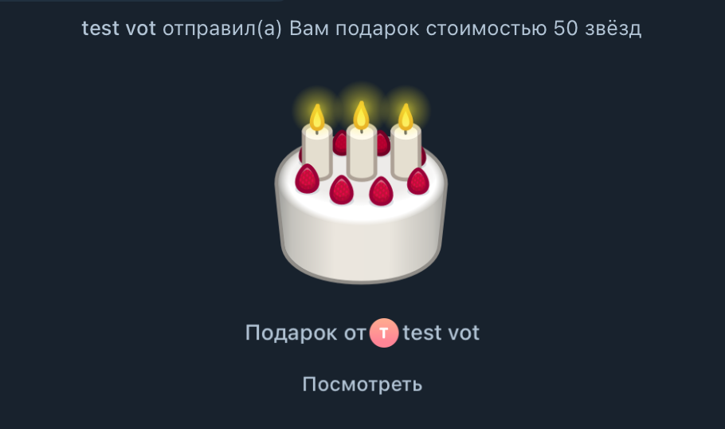

# Stars Sniper Bot 

<div align="center">
  
  
  
  Telegram бот для автоматизации покупки новых Telegram Gifts.
</div>

## Функции

- Автоматическое отслеживание и покупка новых Telegram Gifts
- Два режима работы:
  - Стандартный
  - VIP 
- Настройка режимов покупки:
  - Покупка на весь баланс
  - Процентный лимит от баланса (в разработке)
  - Фиксированный лимит звёзд (в разработке)
- Пополнение баланса звёзд
- Покупка VIP-статуса (так же через звезды)
- Общий банк звёзд в системе
- Управление VIP-статусами
- Изменение баланса пользователей

## Установка

1. Клонируйте репозиторий:
```bash
git clone https://github.com/vmilfe/stars_sniper.git
cd stars_sniper
```

2. Установите Redis:
```bash
# Для Ubuntu/Debian
sudo apt-get update
sudo apt-get install redis-server

# Для MacOS через Homebrew
brew install redis

# Для Windows
# Скачайте Redis с https://github.com/microsoftarchive/redis/releases
```

3. Установите зависимости:
```bash
pip install -r requirements.txt
```

4. Копируйте файл `config.yaml.example` в `config.yaml` 

5. Настройте конфигурацию в файле `config.yaml`

### Запуск

1. Запустите Redis сервер в отдельном терминале:
```bash
# Запуск Redis в фоновом режиме
redis-server --dir src/redis/storage

# Проверить что Redis запущен
redis-cli ping
```

2. В новом терминале запустите бота:
```bash
python3 main.py
```
> **Примечание**: Перед запуском убедитесь, что вы скопировали и настроили файл `config.yaml`

### Dev mode

1. Установите nodemon:
```js
npm install -g nodemon
```

2. Запустите:
```bash
nodemon --ext py main.py
```

### Так же вы можете использовать Docker

1. Соберите и запустите контейнеры:
```bash
docker-compose up -d --build
```

2. Для просмотра логов:
```bash
docker-compose logs -f bot
```

3. Для остановки:
```bash
docker-compose down
```

## Поддержка

По всем вопросам обращайтесь к разработчику:
- Telegram: [@awixa](https://t.me/awixa)